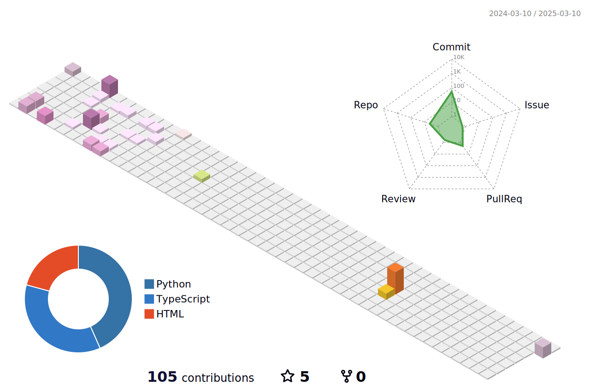

<!-- [**Gráficos**](src\pages\graficos\graficos.md) -->

# Olá, eu sou Silvino Miranda 👋
### Dev Full-Stack Sênior

  
  

---

## Gen AI

  <table>
    <tr>
      <td align="center" width="96">
        
         Agno
      </td>
      <td align="center" width="96">
        
         CrewAI
      </td>
      <td align="center" width="96">
        
         LangChain
      </td>
      <td align="center" width="96">
        
         OpenAI
      </td>
      <td align="center" width="96">
        
         LLM Open Source
      </td>
    </tr>
  </table>

---

## Linguagens de Programação

  <table>
    <tr>
      <td align="center" width="96">
        
         TypeScript
      </td>
      <td align="center" width="96">
        
         JavaScript
      </td>
      <td align="center" width="96">
        
         Java
      </td>
      <td align="center" width="96">
        
         Dart
      </td>
      <td align="center" width="96">
        
         Python
      </td>
      <td align="center" width="96">
        
         C#
      </td>
    </tr>
    <tr>
      <td align="center" width="96">
        
         PHP
      </td>
      <td align="center" width="96">
        
         HTML5
      </td>
      <td align="center" width="96">
        
         CSS3
      </td>
      <td align="center" width="96">
        
         Pascal
      </td>
      <td align="center" width="96">
        
         Delphi
      </td>
    </tr>
  </table>

---

## Frameworks

### Back-end

  <table>
    <tr>
      <td align="center" width="96">
        
         Node.js
      </td>
      <td align="center" width="96">
        
         NestJS
      </td>
      <td align="center" width="96">
        
         Express
      </td>
      <td align="center" width="96">
        
         Spring
      </td>
      <td align="center" width="96">
        
         GraphQL
      </td>
      <td align="center" width="96">
        
         CodeIgniter
      </td>
    </tr>
  </table>

### Front-end

  <table>
    <tr>
      <td align="center" width="96">
        
         AngularJS
      </td>
      <td align="center" width="96">
        
         Karma
      </td>
      <td align="center" width="96">
        
         React
      </td>
      <td align="center" width="96">
        
         Next.js
      </td>
      <td align="center" width="96">
        
         Bootstrap
      </td>
    </tr>
  </table>

### Mobile

  <table>
    <tr>
      <td align="center" width="96">
        
         Flutter
      </td>
    </tr>
  </table>

---

## Bancos de Dados

  <table>
    <tr>
      <td align="center" width="96">
        
         PostgreSQL
      </td>
      <td align="center" width="96">
        
         MySQL
      </td>
      <td align="center" width="96">
        
         Oracle
      </td>
      <td align="center" width="96">
        
         MongoDB
      </td>
      <td align="center" width="96">
        
         Firebase
      </td>
    </tr>
  </table>

---

## DevOps

  <table>
    <tr>
      <td align="center" width="96">
        
         nginx
      </td>
      <td align="center" width="96">
        
         Docker
      </td>
      <td align="center" width="96">
        
         Jenkins
      </td>
      <td align="center" width="96">
        
         Kubernetes
      </td>
      <td align="center" width="96">
        
         GitHub Actions
      </td>
    </tr>
  </table>

---

## Ferramentas

  <table>
    <tr>
      <td align="center" width="96">
        
         Jira
      </td>
      <td align="center" width="96">
        
         Git
      </td>
      <td align="center" width="96">
        
         GitHub
      </td>
      <td align="center" width="96">
        
         GitLab
      </td>
    </tr>
  </table>

---

  

